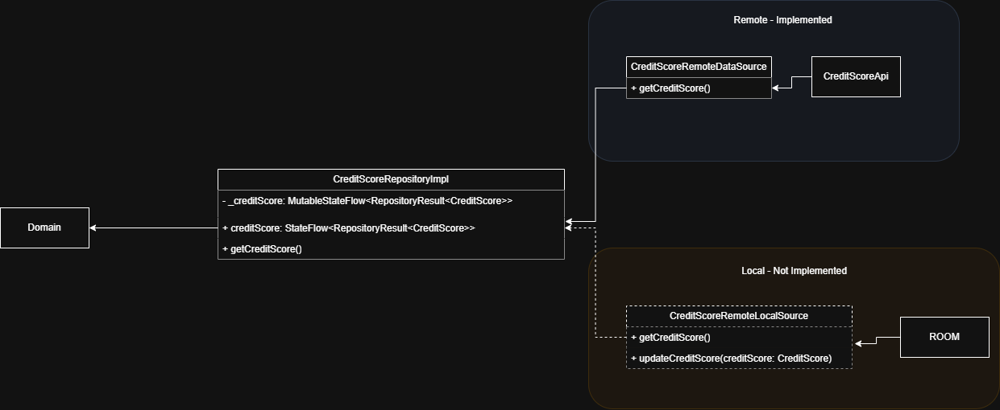
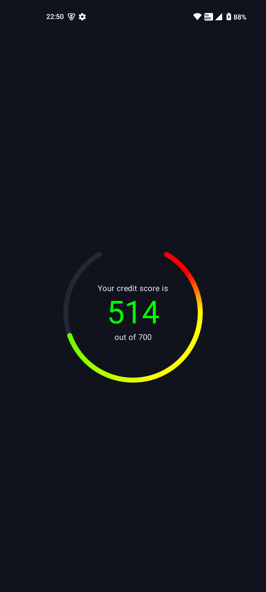
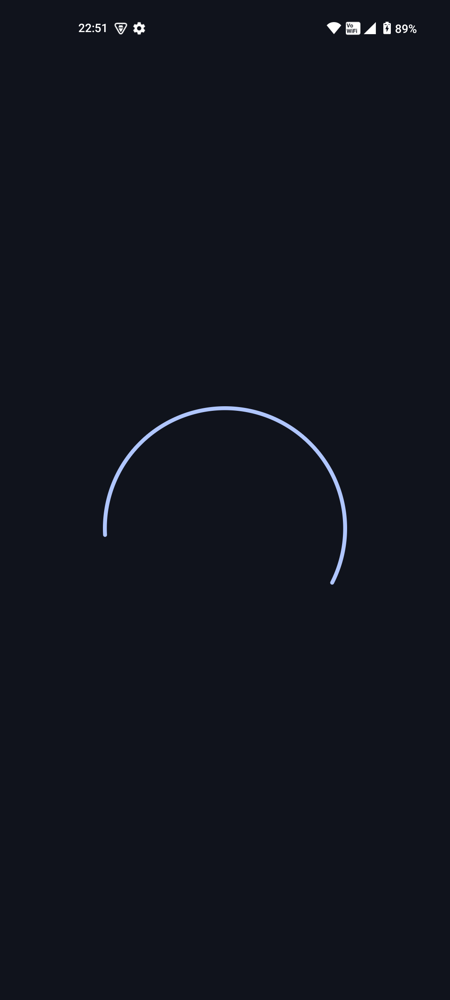
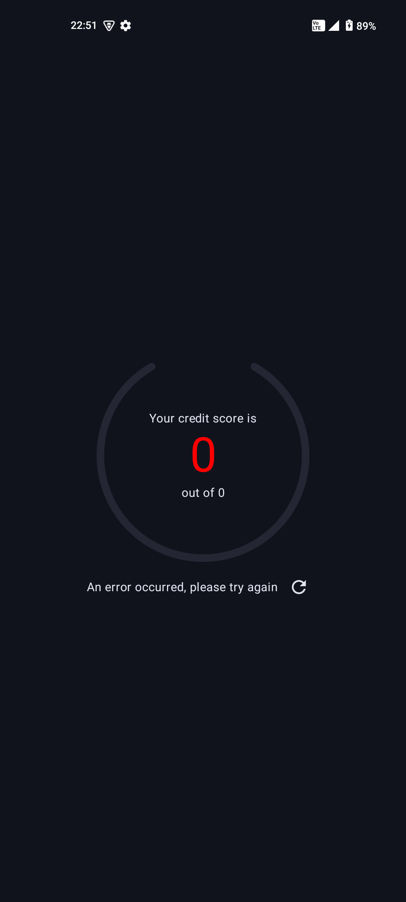

# ClearScore

An Android application that makes request to a single endpoint, grabbing information regarding a users credit score and displaying that on the screen.
Made for a technical interview at ClearScore.

## Dependencies and Libraries

I have opted to use a number of libraries for this project, such as:

### Utility

<ul>
<li><a href="https://insert-koin.io/">Koin</a> - Dependency Injection</li>
<li><a href="https://github.com/square/moshi">Moshi</a> - JSON Parsing</li>
<li><a href="https://square.github.io/retrofit/">Retrofit</a> - HTTP Client</li>
</ul>

I have chosen to use these for a number of reasons. Moshi and Retrofit integrate into eachother nicely with a pre-made [converter](https://github.com/square/retrofit/blob/trunk/retrofit-converters/moshi/README.md), resulting in less boilerplate code and simplifying grabbing data from an endpoint, whilst still allowing flexibility with the underlying OkHTTP Client.

I have also used these libraries both at work and in personal projects, so they are what I'm most comfortable with.

### Testing

<ul>
<li><a href="https://mockk.io/">Mockk</a> - Mocking</li>
<li><a href="https://github.com/square/okhttp/tree/master/mockwebserver">MockWebServer</a> - Mocking HTTP Servers</li>
<li><a href="https://strikt.io/">Strikt</a> - Assertion Library</li>
<li><a href="https://github.com/cashapp/turbine">Turbine</a> - Coroutine Testing Library</li>
</ul>

I opted to use mocking for unit testing, in contrast to Android's reccomendation to Fakes. I have personally found mocks easier to work with and allows for reduced boilerplate code in the main project code.

MockWebServer allowed me to do an integration test to verify the API behaviour on the phone under certain conditions.

Turbine enables easier testing of coroutines and flows throughout the project, and is something I've used in the past.

### Other

<ul>
<li><a href="https://github.com/AAkira/Napier">Napier</a> - SysLogs</li>
</ul>

I chose to use Napier for this project as it is simple to use and compatible with Kotlin 2.0.

## Architecture

I have conciously tried to adhere to the [Android architecture conventions](https://developer.android.com/topic/architecture) as much as possible. This includes splitting the project into modules, namely `app`, `data`, and `domain`.

### App

The `app` layer is relatively simple. There is a `MainActivity` through which the app launches and sets the content to the only screen and viewmodel, being the `CreditScoreScreen` and `CreditScoreViewModel` respectively.

These are implemented in a very generic way, using the exposed `Repository` from the domain layer to interact with the API and `data`.

### Domain

The `domain` layer for this app is very simple, but I included this module for 2 main reasons. First, it is recommended by Android for larger apps, which I envisioned this would grow into if this was a real project. Secondly, because it enforces proper architecure by only exposing the `Repository` to the `app` layer.

### Data

The `data` layer is composed of the API interface for Retrofit, data classes used by Moshi, and a `DataSource` and `Repository`.

The repository is the only class exposed to the `domain` layer as per Android convention. This provides a clean interface through which the `app` layer, aswell as usecases, can interact with the data.

There is a single data source, being remote, which is uses the interface to provide data and states to the repository.

### Common

I have also included a `common-kotlin` module. This contains generic kotlin helper classes that could prove valuable to any other project that also works in Kotlin, e.g. TestRules. Although this could have slotted in anywhere, and depends on the team and company as to whether there is any value in splitting this out. Further common modules could exist if wanted, such as `common-android`.

## UI

I have taken some creative liberty with the wireframe provided. I've attempted to create something that I believe is production-grade, providing a clean user experience and displaying the score in an impactful way.

To consider all states, I have included loading, error and success. On error, the user also has the option to manually refresh.

A small shortcut here is that I mainly designed this around dark mode, although it does still work in light mode the contrast isn't as great and could definitely use some tweaking.

<figure>

<figcaption>Success state</figcaption>
</figure>

<figure>

<figcaption>Loading state</figcaption>
</figure>

<figure>

<figcaption>Error state</figcaption>
</figure>

## Shortcuts

Although I believe this solution covers the assessment task, I have taken two main shortcuts in my approach:

<ol>
<li>There is no local data source / ROOM database - This would be something I would definitely seek to integrate in a real project, to allow the user to view their credit score when connectivity is poor, with some form of "last updated" component on the screen.</li>
<li>No automatic refresh - Currently, it only grabs the credit score on initialisation of the viewmodel or on manual refresh which is only available when an error occurs.</li>
</ol>
